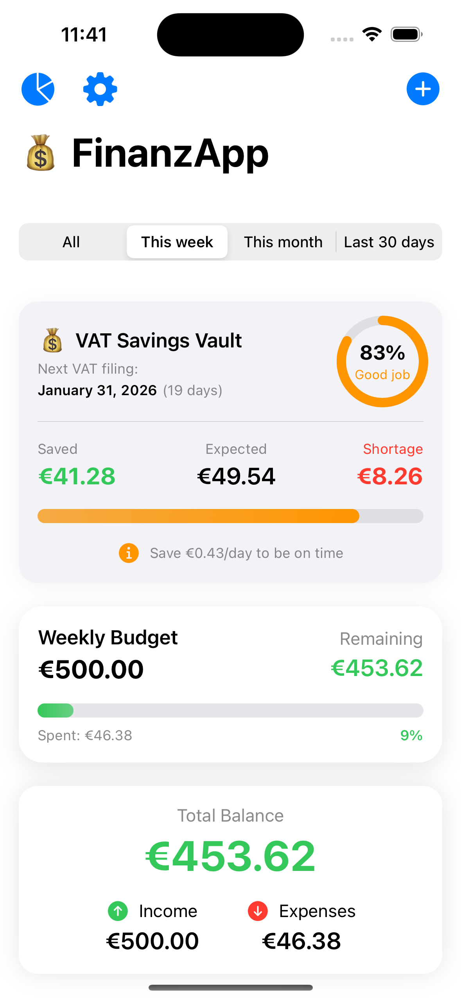
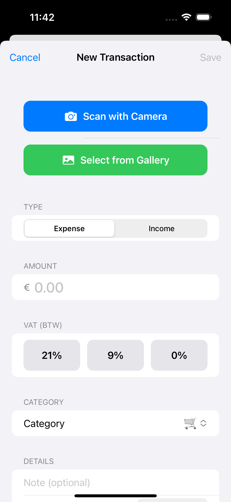
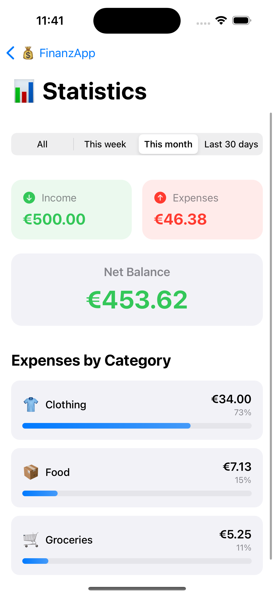
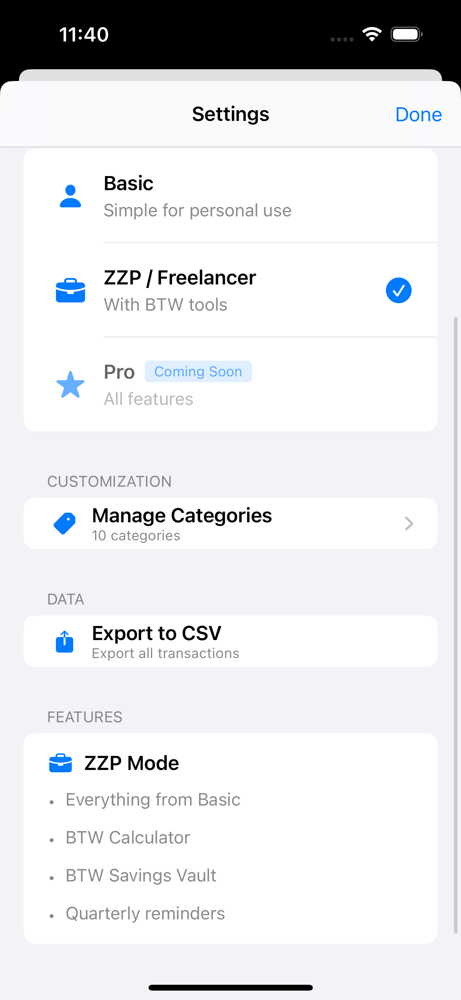

# 💰 FinanzApp

[](https://swift.org)
[](https://developer.apple.com/xcode/swiftui/)
[](https://apple.com)

Smart personal finance tracker built with SwiftUI for the Dutch market. Combines AI-powered receipt scanning with specialized tools for ZZP'ers (freelancers), automating VAT calculations and quarterly tax savings.

## 📸 Screenshots

<p align="center">
  
  
  
  
</p>

## ✨ Features

### 🧠 AI-Powered Receipt Scanning
- Vision Framework + OCR extracts transaction data in under 2 seconds
- Automatic detection of amount, date, and merchant name
- 90% faster than manual entry

### 🇳🇱 Built for Dutch Freelancers (ZZP)
- **BTW Calculator:** Integrated tax rates (21%, 9%, 0%)
- **BTW Spaarkluis:** Track quarterly VAT obligations
- **Deadline Countdown:** Visual reminders for Belastingdienst filing dates
- **Daily Savings Goals:** Smart recommendations

### 📊 Financial Management
- Real-time analytics with interactive charts
- Flexible time filters (week, month, custom periods)
- Custom categories with 106+ emojis
- CSV export for accountants
- Dual modes: Personal (Basic) or Business (ZZP)

## 🛠️ Tech Stack
```
Language:      Swift 5.0
UI:            SwiftUI (100% native)
Architecture:  MVVM
AI/ML:         Vision Framework, VisionKit (OCR)
Reactive:      Combine
Storage:       UserDefaults
Minimum iOS:   16.0+
```

## 🚀 Getting Started
```bash
git clone https://github.com/antoninaarc/FinanzAPP.git
cd FinanzAPP
open FinanzApp.xcodeproj
```

## 👨‍💻 Author

**Antonina Rivera** - [GitHub](https://github.com/antoninaarc)

---

*Financial tool for expense tracking. Always verify tax calculations with a certified accountant.*
